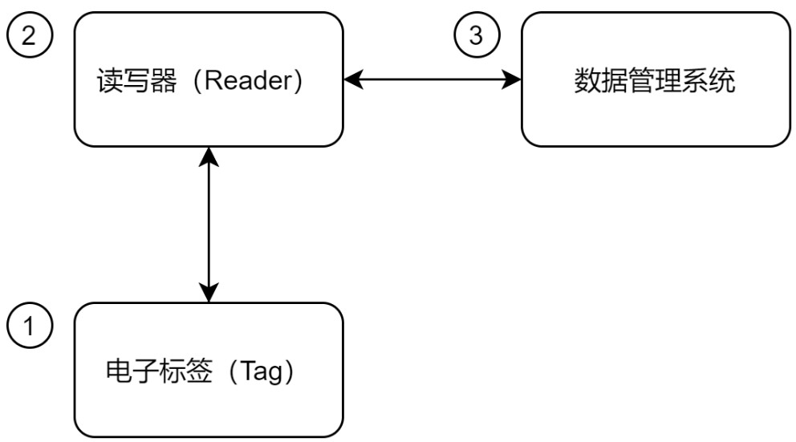

# RFID
RFID技术其实就是指无线电射频技术，其技术主要借助于磁场或者是电磁场原理，通过无线射频方式实现设备之间的双向通信，从而实现交换数据的功能，该技术最大特点就是不用接触就可以获得对方的信息，ETC、物流、图书馆就是比较典型的几个应用场景，RFID技术常用的无线电波频段主要包括:**低频、高频、超高频和微波**几个频段。

# RFID系统组成
RFID系统主要由读写器、电子标签和数据管理系统3个部分组成。

## 读写器(Reader)
主要用于将Tag中的信息读出，或将Tag所需信息写入Tag的设备。根据用途不同，Reader分为只读Reader和读/写Reader，是RFID系统信息控制和处理中心。  
在RFID系统工作时，由Reader在一个区域内发送射频能量形成电磁场，区域的大小取决于发射功率。在Reader覆盖区域内的tag被触发，发送储存在其中的数据，或根据Reader的指令修改储存在其中的数据并能通过接口与计算机网络进行通信。
## 电子标签(Tag)
Tag主要用于储存一定的数据信息，同时它会接受来自Reader的信号，并把所要求的数据送回给Reader，Tag一般会被贴到或者固定安装到物品上。有两种工作方式: 1.RTF(Reader talk first) 2.TRF(Tag talk first)
## 数据管理系统
主要工作是处理Reader传输来的Tag数据进行解析，同时完成用户需要的功能。

# RFID系统工作原理
当Tag处于Reader的识别范围内时，Reader发射特定频率的无线电波能量，Tag将接收到阅读器发出的射频信号，并产生感应电流。  
借助该电流所产生的能量，Tag发送出存储在其芯片中的信息。这类Tag一般称为无源Tag或被动Tag，或者由Tag主动发送某一频率的信号到阅读器，这类电子标签一般称为有源Tag或主动Tag。  
阅读器接收到电子标签返回的信息后，进行解码，然后送至相关应用软件或者数据管理系统，进行数据处理。

# RFID分类
1. 无源RFID  
无源RFID系统通过电磁感应线圈获取能量来对自身短暂供电，完成信息交换。其结构简单、成本低、故障率低，使用寿命较长。然而，无源 RFID的有效识别距离通常较短，一般用于近距离的接触式识别。无源RFID主要工作在较低频段125kHz、13.56MHz等。**无源RFID系统的典型应用包括:公交卡、二代身份证和食堂餐卡等**
2. 有源RFID  
有源RFID系统研发起步较晚，但已应用在各领域。例如ETC，采用了有源 RFID系统。有源RFID通过外接电源或者内置电池供电，主动向阅读器发送信号，拥有了较远的传输距离与较快的传输速度。有源RFID标签可在100m范围与阅读器建立数据通信，读取率可达1700次/s。有源RFID主要工作在90OMHz、2.45GHz、5.8GHz等超高频段和微波频段，且具有可以同时识别多个标签的功能。**有源RFID系统的上述特性使其广泛应用于高性能、大范围的RFID场景**
3. 半有源RFID  
由于无源RFID系统有效识别距离较短；有源RFID识别距离足够长，但需外接电源或者内置电池，体积较大。为了解决这一矛盾，半有源RFID系统应运而生。半有源RFID技术又称为低频激活触发技术。在通常情况下，半有源RFID标签处于休眠状态，仅对标签中保持数据的部分进行供电，因此耗电量较小，可维持较长的时间。当标签进入RFID阅读器的识别范围后，阅读器先以125kHz的低频信号在小范围内精确激活标签使之进入工作状态，再通过2.4GHz的微波与其进行信息传递。也就是说，在不同位置安置多个低频阅读器用于激活半有源RFID 产品，由此，既能实现定位，又能实现数据的采集与传输。

# 原理
RFID卡与读卡器各自都有一个电感线圈，我们把RFID卡靠近相应的读卡器时，读卡器内部的电感耦合线圈一方面充当了变压器初级线圈的作用，为无源的RFID识别卡供电——此时RFID卡上的电感线圈相当于变压器的次级线圈，另一方面RFID卡中的芯片将其内部所存储的信息调制在RFID卡片的线圈上（**其调制原理是有规律的改变线圈的阻抗从而有规律的改变电感初级线圈的负载**），RFID读卡器通过检测其内部的电感线圈的阻抗改变规律，便可以将RFID卡片内的信息读取出来。  
这也就是为什么RFID技术只能用于近程的识别与读卡——互偶电感的两个线圈距离不能过远，否则能量将会迅速衰减到0.

# 发展
实现RFID资产管理，可以考虑采用NB-IOT或者Lora技术，将RFID读写器采集到的数据实时传输到Lora基站，并上传到后端。  
作为RFID的升级技术，NFC的原理本质是一样的，不过其功能得到了极大的增强。NFC技术中，互偶电感的两个线圈可以都是有源的线圈，比如两台手机，此时相互靠近的两个有源NFC线圈则只负责通信功能，不再需要为另一方供电，因而其通信速率得到大大提高——高达几百bps。  

