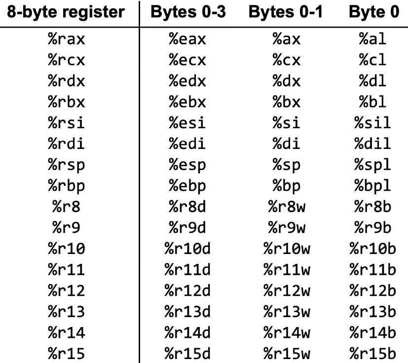
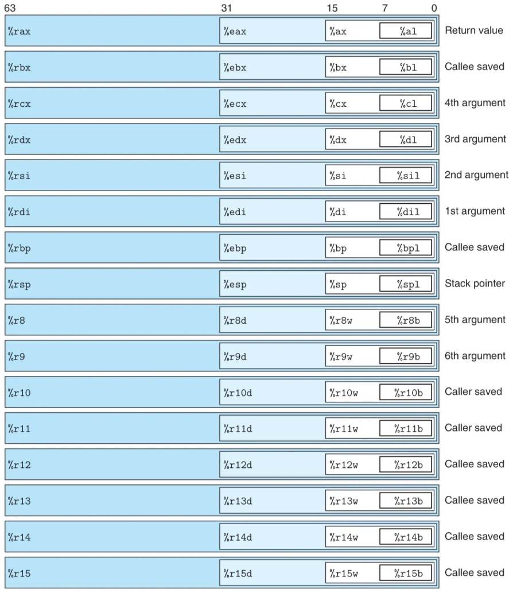
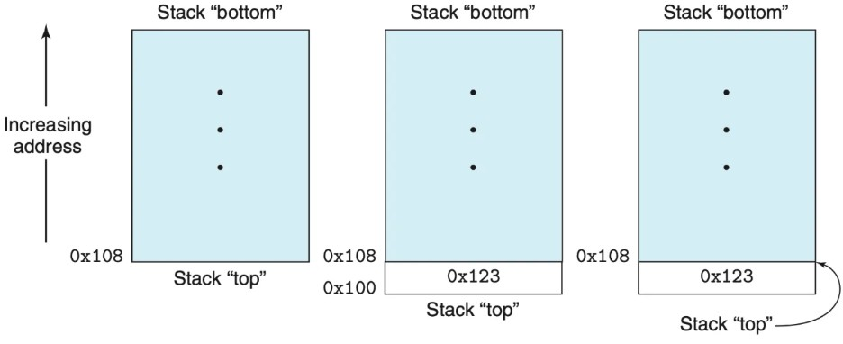
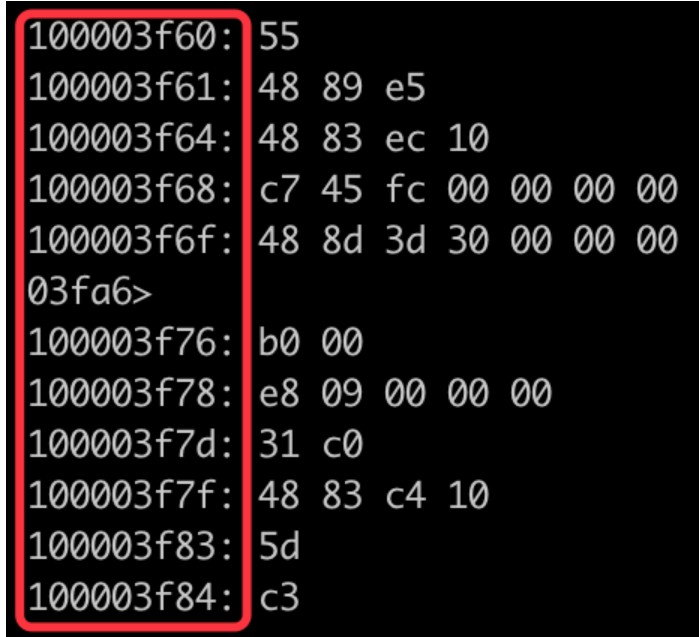
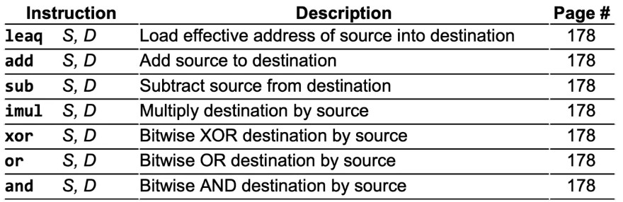
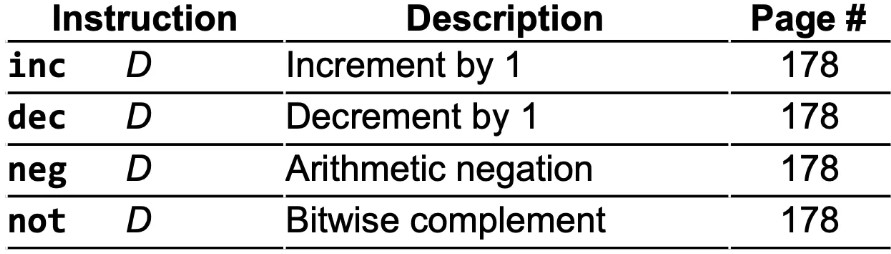
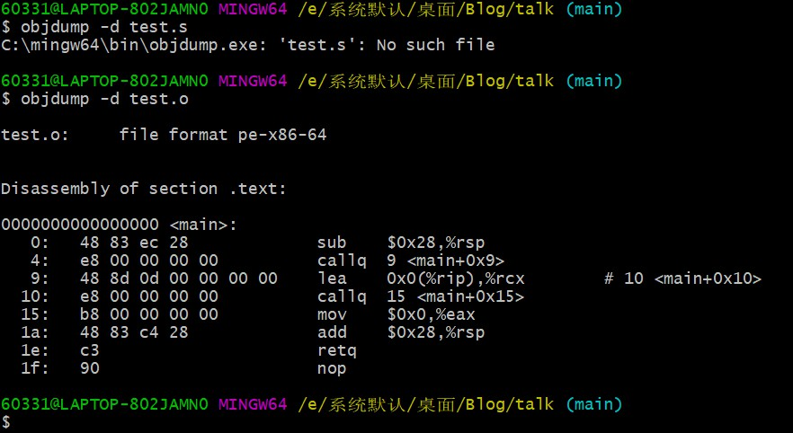
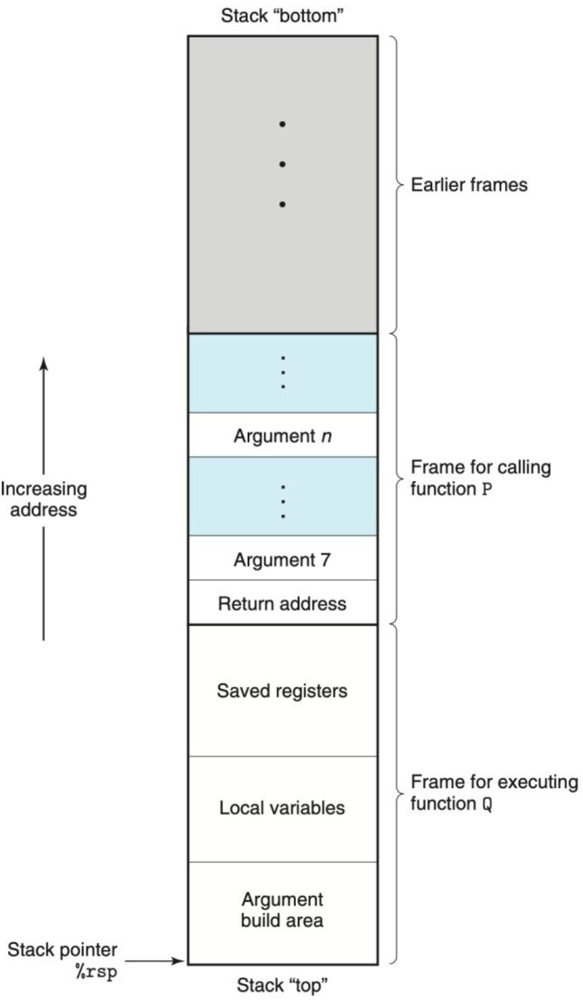

预处理器把源代码中的宏去掉/替换 -> 由编译器将源代码翻译为汇编程序 -> 由汇编器将汇编程序翻译为目标文件 -> 链接器则将多个目标文件合为一个可执行文件

- [x86_64](#x86_64)
    - [寄存器](#寄存器)
    - [虚拟内存](#虚拟内存)
    - [栈](#栈)
    - [PC寄存器](#pc寄存器)
- [指令](#指令)
    - [操作数](#操作数)
    - [操作码](#操作码)
- [实战](#实战)

# X86_64
## 寄存器
16个64位的寄存器(而构成的寄存器文件)

**16个寄存器，为什么有64个名称?**  
因为我们遇到的变量不一定都是64位的。以%rax为例，比如我要存储一个char类型的变量，那么我用得到的只有它的低8位，所以专门为这8位取名为%al（l代表low）；同理，如果要存储short类型的变量，则要用到它的低16位，专以%ax名之；若变量是int类型的，则要用到低32位，以%eax命名。  
这16个寄存器中，有的要承担特殊的任务，如果%rsp用于指向栈顶，%rax(及%eax等)要存储函数返回的值，有6个寄存器要用来保存函数的参数值，而有的则没有限制。其它寄存器还有caller-saved（调用者保存）, callee-saved（被调用者保存）的特性，这些在下文都会有详细的解释。  

## 虚拟内存
不管是二进制代码本身还是部分临时变量都存储在内存中(还有部分存储在寄存器文件中)，它们时刻准备着为CPU所用(访问或写入)。
## 栈
它储存着临时变量，担任过程调用的中转站即保存返回地址，（可能过多的）参数，为当前过程储存临时变量。  
栈最重要的特征是有一个栈顶指针，这就是%rsp(16个寄存器之一)。我们知道，栈能操作的数据只有存储在栈顶的数据，所以几乎所有与栈相关的指令都离不开这根指针。栈有两个操作：压栈(push)和弹出（pop）。实际上，压栈是指，将栈顶指针往下移动若干个字节，使得栈的容量增大，再把新的数据填入栈顶。**为什么要往下移动呢？因为栈是向下“生长”的，也就是说，新进来的数据的地址小于旧的数据，而弹出是指，将栈顶指针上移若干字节。不必改变原来栈顶的值，因为随着栈顶指针的上移，原来的栈顶已经被排除在栈的范围之外。**

在过程调用中，栈被分为多个部分，每一部分专门为一个过程服务，被称为“栈帧”。
```
栈帧（stack frame）是一种在程序执行过程中用于存储每一个函数调用的数据结构。它是运行时内存中的一部分，存储了函数的参数、返回地址、临时变量和其他执行环境相关的信息。
在计算机程序的执行过程中，当一个函数被调用时，系统会为这个函数分配一个新的栈帧，并将其压入栈顶，当函数执行结束并返回时，该栈帧就会从栈顶弹出
```
## PC寄存器
在汇编语言中以%rip表示，是非常关键的寄存器，它是CPU执行指令时的“指挥棒”。因为指令序列都保存在内存中，所以每一条指令都有相应的（虚拟）地址
  
**PC寄存器就存储着正在执行的指令的下一条要执行的指令**，PC寄存器并不会显式地出现在汇编代码中，其值的变化都是暗地里进行的。

## Flag寄存器（eflag: x86 32位）
条件码（Flag）是一种特殊的寄存器，它用于记录最近一次进行算术或逻辑指令后的状态，比如运算结果是否为零，是否溢出等信息。这些信息可以在后面的指令中使用，以决定后续的控制转移。例如，如果条件码记录着一个数值为零，那么在下一条指令中，就可以根据这个信息执行不同的操作。

# 指令
汇编代码一个指令可以完成一个CPU操作。一条指令由操作码和0～2个操作数构成。操作码指定了当前指令要执行的操作，如将两数相加，操作数则是操作码的作用对象。因此可以看出，**指令的长度不固定，短则1个字节，长则15字节。**
## 操作数
操作数可以是立即数、寄存器、内存地址。  
举例来说，$5是立即数，它的值5；%rax是寄存器，它的值是寄存器%rax中的值；0xf7是内存地址，它的值是内存中地址为0x07的某种类型的值；(%rax)也是内存的地址，只不过，该地址保留在寄存器%rax中；0xf7(%rax, %rbp, 4)也是内存的地址，所有的内存寻址方式都可以写成这种类型。
## 操作码
操作码分为算术逻辑类、数据传输类、控制类等等。
### 算术逻辑类
```
addq $3, %rdi
```
add代表相加，第一个操作数是源操作数，第二个是目的操作数。这个指令把立即数3加到寄存器%rdi中。如果之前%rdi中存储的值是8，则执行该指令之后变为11。

**add的后缀q代表着操作数的大小。有4种后缀：**  
b-字节(byte，8比特)  
w-字(word，16比特)  
l-双字(doubleword，32比特)  
q-四字(quadword, 64比特)  


### 数据传输类
```
movb $bl, %al
表示把%bl寄存器中的值赋值给%al

pushq %rbp
表示将%rbp的值压入栈中：即先使栈顶指针寄存器%rsp的值减少8，再将%rbp的值赋值给%rsp所指的内存单元。(回忆前面讲的压栈)

popq %rsi
表示将栈顶的8个字节的值弹出，并赋给寄存器%rsi。
```
### 控制类
jnz...
### 比较和测试操作码
```
cmpb %al, %bl
testq %rax, %rbx
```

# 实战
hello.c
```
#include <stdio.h>

int main()
{
    printf("Hello World!");
    return 0;
}
```
使用命令```gcc -Og -S hello.c```得到hello.s的文件  
然而，这样的到的汇编代码不够简洁和整齐。我们将使用下面的方法得到汇编代码:  
首先编译源代码得到目标文件hello.o:  
```gcc -c -Og hello.c```  
然后用反汇编命令:  
```objdump -d hello.o```

这样的代码更整洁

## 例1
```
void foo(){
    return;
}
```
一个什么也没有做的函数，没有参数也没有返回值。让我们看看它的汇编代码是什么：
```
0000000000000000 <_foo>:
       0: 55                           	pushq	%rbp
       1: 48 89 e5                     	movq	%rsp, %rbp
       4: 5d                           	popq	%rbp
       5: c3                           	retq
```
* ```0000000000000000 <_foo>:```  
第一部分是16个0。注意，这个0可不是简单的0，它是16进制的0，所以这些0其实是64个0。而系统是64位的……所以你能猜到了吧，它是这个函数所在的虚拟地址。  
第二部分是<_foo>，_foo是函数名，是这个函数的标记用，当其它函数要调用此函数时就需要用到函数名。汇编的函数名是原来的函数名前加上"_"前缀而生成的。  
* ```第一列的0 1 4 5```  
这个是各指令的地址，也是16进制的。因为第二条指令有3个字节(48 89 e5)，所以第3条指令与第2条指令的地址相差3。  
* 而地址冒号后面就是指令的机器码了
* 再后面就是汇编代码
    * ```pushq %rbp```  
    将%rbp的值压入栈中。为什么要这样做？因为寄存器有“调用者保存”和“被调用者”保存的规则。16个寄存器，除了%rsp要存储栈顶指针外，一般来说剩下的15个都可以用作存储变量。但是当涉及函数调用时，部分寄存器的功能就用限制了：**%rax将被用作存储返回值；%rdi, %rsi, % rdx, %rcx, %r8, %r9这六个寄存器将被用来保存参数；剩下8个仍然可以保存任何数值。**  
    但问题是，寄存器只有一套， 现在要两个函数（父函数和子函数）来使用，势必产生冲突，那怎么办呢？  
    答案是在子函数使用之前将这些寄存器的值保存在栈中，待子函数使用完成后，再将栈中保存的值还给寄存器。根据谁负责保存这些寄存器，可以把它们分为两类：  
    "调用者保存"和"被调用者保存"。"调用者保存"（caller-saved）：即在调用子函数之前，将父函数用过的寄存器压栈; "被调用者保存"：即在子函数内，对即将使用的寄存器压栈。
      
    因此显而易见，我们将%rbp压栈是因为第二行代码改变了%rbp的值，而%rbp是被调用者保存寄存器。
    * ```movq %rsp, %rbp```  
    这行代码是将%rsp的值赋值给%rbp。这行代码在这里显得比较多余（但在后面的例子中将看到它的作用），它的作用是让%rbp成为基指针，后续函数(多于6个）的参数，中间变量等等保存的地址就是以%rbp所指向的地址的偏移。
    * ```popq %rbp```  
    将栈顶的数据弹出，并赋给%rbp。这与pushq %rbp相对应，旨在恢复%rbp以前的值。
    * ```retq```  
    被调用者执行完毕，返回调用者。
## 例2
```
int foo(){
    return 0;
}
```
```
0000000000000000 <_foo>:
       0: 55                           	pushq	%rbp
       1: 48 89 e5                     	movq	%rsp, %rbp
       4: 31 c0                        	xorl	%eax, %eax
       6: 5d                           	popq	%rbp
       7: c3                           	retq
```
```4: 31 c0                        	xorl	%eax, %eax```这是将%eax与自身作按位异或，其结果是%eax的值变为0(而且是int类型)。而%eax恰好是保存返回值的。
## 例3
```
int foo(int a, int b){
    return a + b;
}
```
```
0000000000000000 <_foo>:
       0: 55                           	pushq	%rbp
       1: 48 89 e5                     	movq	%rsp, %rbp
       4: 8d 04 37                     	leal	(%rdi,%rsi), %eax
       7: 5d                           	popq	%rbp
       8: c3                           	retq
```
源代码中，两个参数相加并返回被编译成这一行汇编代码。先看看leal的作用，它将%rdi和%rsi的值相加，赋给%eax。在例1已经进行说明，%rdi和%rsi分别储存第一个和第二个参数，%eax储存返回变量。所以这行代码完美对应源代码。

寄存器文件中只有6个寄存器用于传递参数，但如果有7或更多个参数怎么办呢？我们为此进行下一个实验。
## 例4
8个参数
```
int foo(int a1, int a2, int a3, int a4, int a5, int a6, int a7, int a8){
    return a1 + a2 + a3 + a4 + a5 + a6 + a7 + a8;
}
```
```
0000000000000000 <_foo>:
       0: 55                           	pushq	%rbp
       1: 48 89 e5                     	movq	%rsp, %rbp
       4: 8d 04 37                     	leal	(%rdi,%rsi), %eax
       7: 01 d0                        	addl	%edx, %eax
       9: 01 c8                        	addl	%ecx, %eax
       b: 44 01 c0                     	addl	%r8d, %eax
       e: 44 01 c8                     	addl	%r9d, %eax
      11: 03 45 10                     	addl	16(%rbp), %eax
      14: 03 45 18                     	addl	24(%rbp), %eax
      17: 5d                           	popq	%rbp
      18: c3                           	retq
```
6个参数传递的寄存器%rdi, %rsi, %edx, %ecx, %r8d, %r9d依次出现，再次验证了前6个参数确实保存在这些寄存器内。而红框内最后两行则是将%rbp上面第16字节和24字节的doubleword型数据加到%eax上，说明第7、8个参数存储在这两个地方。**看来若多余6个参数的话，多余的参数会保存在栈中来进行传递。**

但是，为什么是%rbp偏移16、24个字节呢？为了看清楚为什么第7、8个参数会被保存在这个位置，我们继续进行下面的实验。
## 例5
```
int callee(int a1, int a2, int a3, int a4, int a5, int a6, int a7, int a8){
    return a1 + a2 + a3 + a4 + a5 + a6 + a7 + a8;
}

int caller(){
    return callee(1, 2, 3, 4, 5, 6, 7, 8) + 9;
}
```
```
0000000000000000 <_callee>:
       0: 55                           	pushq	%rbp
       1: 48 89 e5                     	movq	%rsp, %rbp
       4: 8d 04 37                     	leal	(%rdi,%rsi), %eax
       7: 01 d0                        	addl	%edx, %eax
       9: 01 c8                        	addl	%ecx, %eax
       b: 44 01 c0                     	addl	%r8d, %eax
       e: 44 01 c8                     	addl	%r9d, %eax
      11: 03 45 10                     	addl	16(%rbp), %eax
      14: 03 45 18                     	addl	24(%rbp), %eax
      17: 5d                           	popq	%rbp
      18: c3                           	retq
      19: 0f 1f 80 00 00 00 00         	nopl	(%rax)

0000000000000020 <_caller>:
      20: 55                           	pushq	%rbp
      21: 48 89 e5                     	movq	%rsp, %rbp
      24: bf 01 00 00 00               	movl	$1, %edi
      29: be 02 00 00 00               	movl	$2, %esi
      2e: ba 03 00 00 00               	movl	$3, %edx
      33: b9 04 00 00 00               	movl	$4, %ecx
      38: 41 b8 05 00 00 00            	movl	$5, %r8d
      3e: 41 b9 06 00 00 00            	movl	$6, %r9d
      44: 6a 08                        	pushq	$8
      46: 6a 07                        	pushq	$7
      48: e8 00 00 00 00               	callq	0x4d <_caller+0x2d>
      4d: 48 83 c4 10                  	addq	$16, %rsp
      51: 83 c0 09                     	addl	$9, %eax
      54: 5d                           	popq	%rbp
      55: c3                           	retq
```
我们发现代码将立即数$1～6分别按顺序装入对应寄存器，这没问题。之后，先后将立即数$8和$7压栈，%rsp在这个过程中隐式地减少了8+8=16个字节（因为装下一个quadword需要8个字节）。从这儿我们可以看到多出的参数是从后往前依次压栈的。所以例4中16(%rbp)中保存着$7，24(%rbp)保存着$8。--栈是从大地之向小地址分配  
```48: e8 00 00 00 00               	callq	0x4d <_caller+0x2d>```这条指令是调用callee函数，然而，callq 后的操作数0x4d <_caller+0x2d>并不是callee的地址，因为我展示的程序是未链接的，callq并不知道callee的地址。链接之后的汇编代码为```100003fa8: e8 b3 ff ff ff              	callq	0x100003f60 <_callee>```callq的操作数0x100003f60 <_callee>正是callee的地址。  
这个过程隐式地发生了如下事件：  
* 将“返回地址”压栈。所谓返回地址就是调用指令的下一条指令的地址，如这里(链接后的程序)的返回地址是100003fad。将返回地址压栈的目的是使子函数执行完毕后能继续执行下一条执行。再次提醒，压栈意味着%rsp将减少8个字节。(在64位系统中地址为8个字节)
* 将PC寄存器设置为被调用函数的地址，这里是0x100003f60。前面已经说过，PC寄存器是指挥棒，它指向哪条指令，CPU下一步就执行哪一条。所以执行callq指令后，下一步就将开始执行callee的指令。

**Then, 为何参数7与%rbp的地址相差16个字节？参数8与%rbp的地址相差24字节。** 这是因为参数7的地址与%rbp隔着"返回地址"和“%rbp的旧值”两个值，共16个字节，而参数8除了隔着这16字节，还隔着参数7所占的8字节。

function P是一个调用者函数，function Q则是一个被调用者。
前文说过，在程序执行过程中，栈被分为多个“栈帧”，如上图所展示的。不同的过程都有自己所属的栈帧，正在执行的过程的栈帧处于栈的最“顶”部。  
栈帧是过程调用中传递参数，储存返回信息、寄存器和局部变量的区域。相信通过前面的例子，我们已经见识到了栈帧的厉害。我们这里将过程调用的整个流程梳理一遍，其中涉及栈帧的我将用粗体标记：  
1. 在调用者中，将所需参数保存在6个寄存器中；如果参数多于6个，则将多余的参数从后往前依次压栈，注意参数的大小要扩充为8的倍数。
2. 将返回地址压栈
3. 将被调用者的地址传递给PC寄存器%rip
4. 将被调用者保存寄存器压栈
5. 为局部变量分配内存空间
6. 执行被调用者的指令
7. 将返回值保存在%rax中
8. 增加%rsp的值以销毁当前栈帧
9. 执行retq指令。这条指令将返回地址赋给PC寄存器

PS：若返回值不能用寄存器保存，也将储存在栈帧中。    
图中展示的栈帧的结构是普遍意义上的，但是在很多情况下，有些单元并不是必须的。如在例1～例3中，函数的参数不超过6个，也就没有分配内存来存储第7到n个参数。再如，Local variables区域是用来存储临时变量的，但有些函数并不需要临时变量。


