ELF: Executable and Linkable Format  

掌握 ELF 文件的结构和内容，是理解编译、链接和程序执行的基础。

- [elf结构](#elf结构)
- [ELF 文件主要用来表示 3 种类型的文件](#linux-系统中一个-elf-文件主要用来表示-3-种类型的文件)
- [链接器和加载器](#链接器和加载器)
- [至此总结一下](#至此总结一下)
- [四部分内容的数据结构](#四部分内容的数据结构)
    - [ELF header](#elf-header)
    - [Program header table](#program-header-table)
    - [Section header table](#section-header-table)
    - [Sections](#sections)
- [从字节码的粒度来看elf](#从字节码的粒度来看elf)
    - [字符串表表项 Entry](#字符串表表项-entry)
    - [读取字符串表 Section 的内容](#读取字符串表-section-的内容)
    - [读取代码段的内容](#读取代码段的内容)
    - [Program header](#program-header)
- [总结](#总结)

## elf结构  


## Linux 系统中，一个 ELF 文件主要用来表示 3 种类型的文件：
 1. 可执行文件
 2. 目标文件(.o)
 3. 共享文件(.so)

那么在文件中，肯定有一个地方用来区分这 3 种情况：ELF头部存在字段表示

3种文件在3种不同的场合下被使用:  
1. 可执行文件：被操作系统中的加载器从硬盘上读取，载入到内存中去执行
2. 目标文件：被链接器读取，用来产生一个可执行文件或者共享库文件
3. 共享库文件：在动态链接的时候，由 ld-linux.so 来读取

## 链接器和加载器  
链接器  
  
链接器只关心 ELF header, Sections 以及 Section header table 这 3 部分内容

加载器  
  
加载器只关心 ELF header, Program header table 和 Segment 这 3 部分内容。从加载器的角度看，对于中间部分的 Sections, 它改了个名字，叫做 Segments(段)。换汤不换药，本质上都是一样一样的。  
可以理解为：一个 Segment 可能包含一个或者多个 Sections  


## 至此总结一下  
1. 一个 ELF 文件一共由 4 个部分组成
2. 链接器和加载器，它们在使用我的时候，只会使用它们感兴趣的部分

在 Linux 系统中，会有不同的数据结构来描述上面所说的每部分内容。
## 四部分内容的数据结构
### ELF header
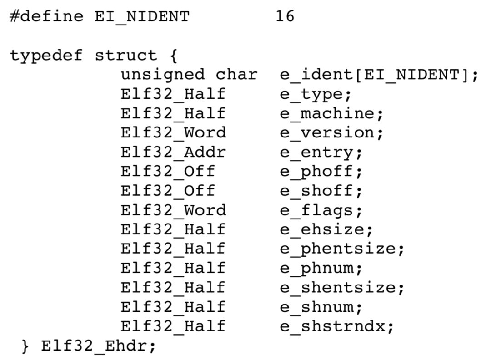  
头部内容，就相当于是一个总管，它决定了这个完整的 ELF 文件内部的所有信息  
1. 这是一个 ELF 文件
2. 一些基本信息：版本，文件类型，机器类型
3. Program header table(程序头表)的开始地址，在整个文件的什么地方
4. Section header table(节头表)的开始地址，在整个文件的什么地方

### Program header table
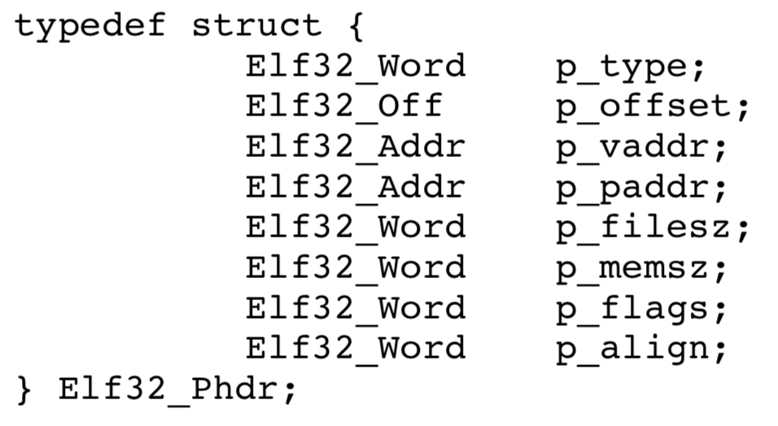  

### Section header table
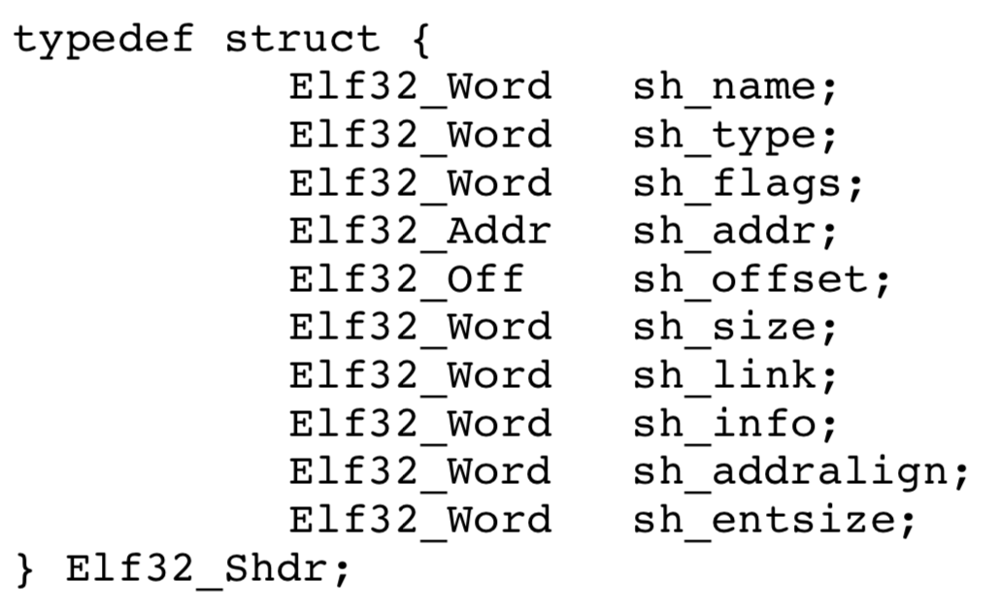  

### Sections
在一个 ELF 文件中，存在很多个 Sections，这些 Sections 的具体信息，是在 Program header table 或者 Section head table 中进行描述的  
假如一个 ELF 文件中一共存在 4 个 Section: .text、.rodata、.data、.bss，那么在 Section head table 中，将会有 4 个 Entry(条目)来分别描述这 4 个 Section 的具体信息(严格来说，不止 4 个 Entry，因为还存在一些其他辅助的 Sections)，就像下面这样：  
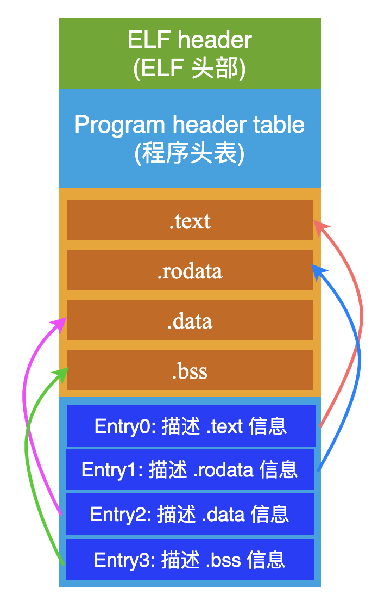

## 从字节码的粒度来看elf
例程如下:  

```c
// mymath.c
int my_add(int a, int b)
{
    return a + b;
}

// main.c
#include <stdio.h>
extern int my_add(int a, int b);

int main()
{
   int i = 1;
   int j = 2;
   int k = my_add(i, j);
   printf("k = %d \n", k);
}
```
动态库文件 libmymath.so, 目标文件 main.o 和 可执行文件 main，它们都是 ELF 文件，只不过属于不同的类型。  

首先用指令 readelf -h main 来看一下 main 文件中，ELF header 的信息。  
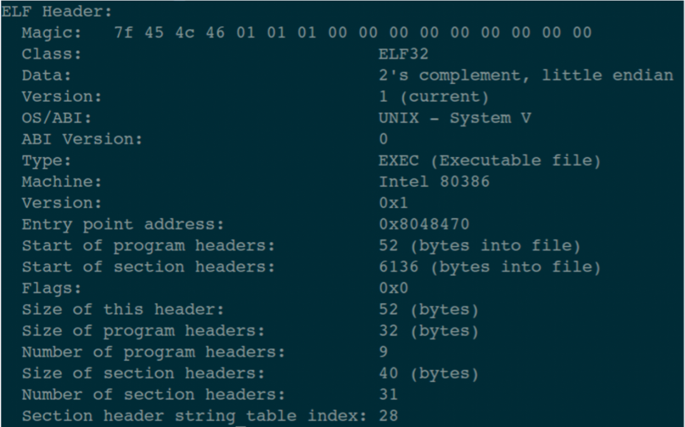  
这个内容与结构体 Elf32_Ehdr 中的成员变量是一一对应的！  

第 15 行显示的内容：Size of this header: 52 (bytes)。也就是说：ELF header 部分的内容，一共是 52 个字节。  
用 ```od -Ax -t x1 -N 52 main``` 这个指令来读取 main 中的字节码，简单解释一下其中的几个选项：
```
-Ax: 显示地址的时候，用十六进制来表示。如果使用 -Ad，意思就是用十进制来显示地址;

-t -x1: 显示字节码内容的时候，使用十六进制(x)，每次显示一个字节(1);

-N 52：只需要读取 52 个字节;
```
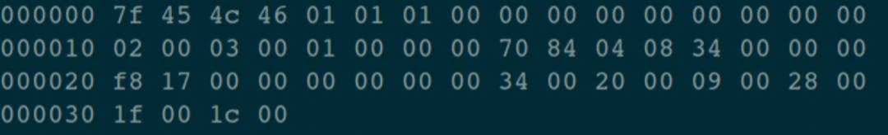

这 52 个字节的内容，你可以对照上面的结构体中每个字段来解释了。  

**首先看一下前 16 个字节。** 在结构体中的第一个成员是 unsigned char e_ident[EI_NIDENT];，EI_NIDENT 的长度是 16，代表了 EL header 中的开始 16 个字节，具体含义如下：  
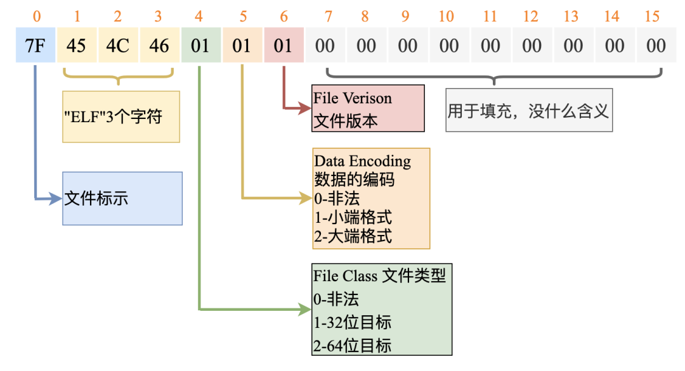
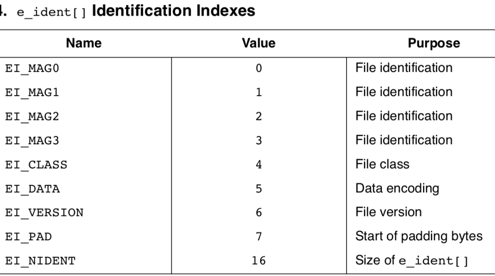

_大小端_：  
小端：  
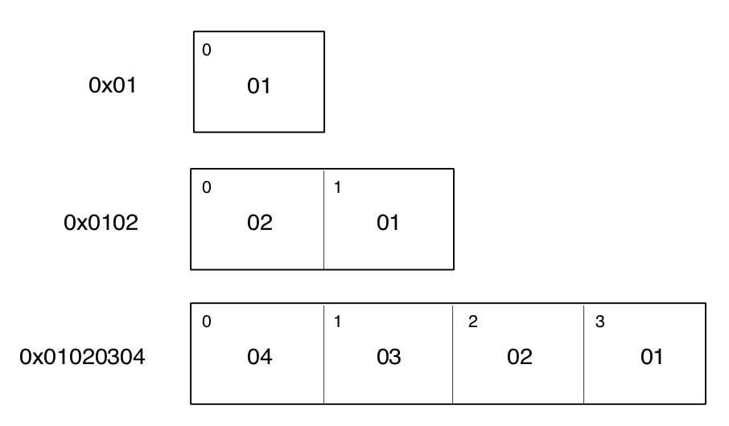  
大端：  
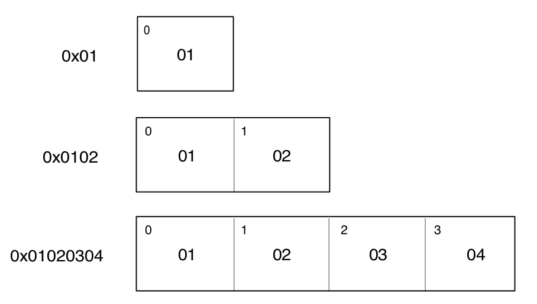  

**下面我们继续把剩下的 36 个字节(52 - 16 = 32)**，也以这样的字节码含义画出来：  
16 - 31 个字节：  
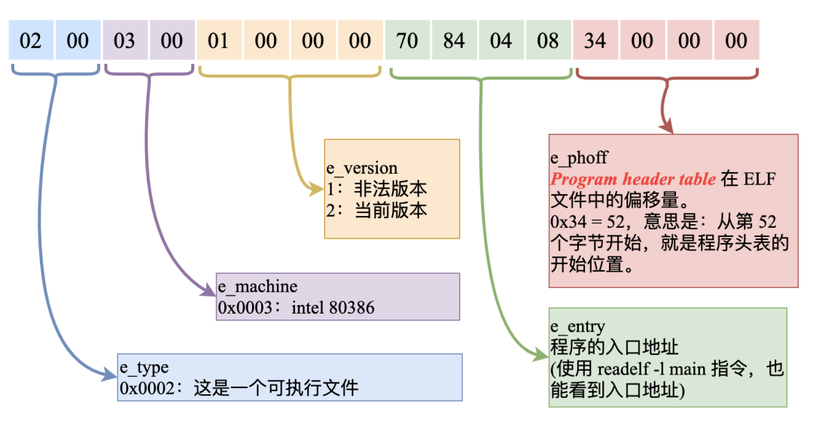  
32 - 47 个字节：  
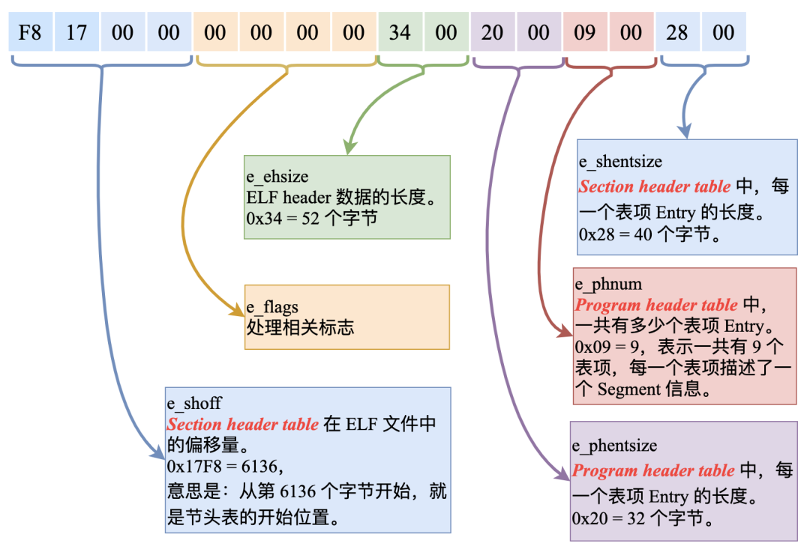  
48 - 51 个字节：  
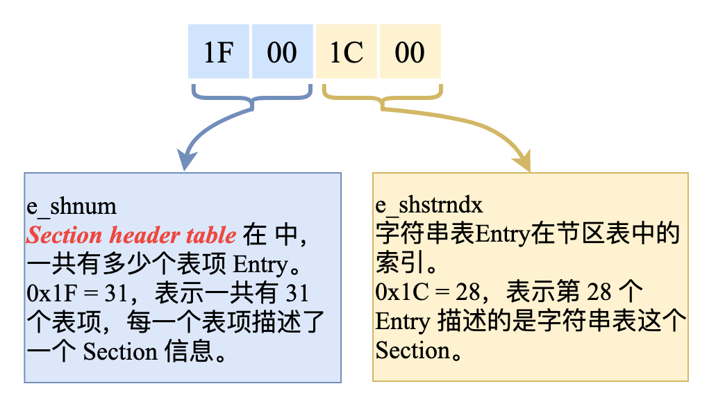  
在 ELF header 的最后 2 个字节是 0x1C 0x00，它对应结构体中的成员 e_shstrndx，意思是这个 ELF 文件中，字符串表是一个普通的 Section，在这个 Section 中，存储了 ELF 文件中使用到的所有的字符串。  

### 字符串表表项 Entry
一个 ELF 文件中，存在很多字符串，例如：变量名、Section名称、链接器加入的符号等等，这些字符串的长度都是不固定的，因此用一个固定的结构来表示这些字符串，肯定是不现实的。于是，聪明的人类就想到：**把这些字符串集中起来，统一放在一起，作为一个独立的 Section 来进行管理。**  

在文件中的其他地方呢，如果想表示一个字符串，就在这个地方写一个数字索引：表示这个字符串位于字符串统一存储地方的某个偏移位置。  

比如下面的空间存储了所有字符串：  
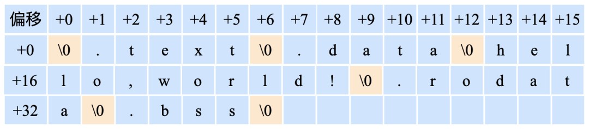  
在程序的其他地方，如果想引用字符串 “hello,world!”，那么就只需要在那个地方标明数字 13 就可以了，表示：这个字符串从偏移 13 个字节处开始。  

既然这是一个 Section，那么在 Section header table 中，就一定有一个表项 Entry 来描述它，那么是哪一个表项呢？  
这就是 0x1C 0x00 这个表项，也就是第 28 个表项。这里，我们还可以用指令 readelf -S main 来看一下这个 ELF 文件中所有的 Section 信息：  
  
其中的第 28 个 Section，描述的正是字符串表 Section:  
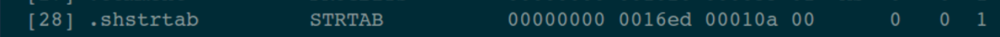  
可以看出来：这个 Section 在 ELF 文件中的偏移地址是 0x0016ed，长度是 0x00010a 个字节。  

### 读取字符串表 Section 的内容
如何通过 ELF header 中提供的信息，把字符串表这个 Section 给找出来，然后把它的字节码打印出来?  
```s
要想打印字符串表 Section 的内容，就必须知道这个 Section 在 ELF 文件中的偏移地址。

要想知道偏移地址，只能从 Section head table 中第 28 个表项描述信息中获取。(28 是由 elf header 中的 0x1C 0x00 得到的)

要想知道第 28 个表项的地址，就必须知道 Section head table 在 ELF 文件中的开始地址，以及每一个表项的大小（由elf header中的字段可得）。
```
ELF header 中的第 32 到 35 字节内容是：F8 17 00 00(注意这里的字节序，低位在前)，表示的就是 Section head table 在 ELF 文件中的开始地址(e_shoff)。  
0x000017F8 = 6136，也就是说  Section head table 的开始地址位于 ELF 文件的第 6136 个字节处。  
知道了开始地址，再来算一下第 28 个表项 Entry 的地址。ELF header 中的第 46、47 字节内容是：28 00，表示每个表项的长度是 0x0028 = 40 个字节。  
注意这里的计算都是从 0 开始的，因此第 28 个表项的开始地址就是：6136 + 28 * 40 = 7256，也就是说用来描述字符串表这个 Section 的表项，位于 ELF 文件的 7256 字节的位置。  
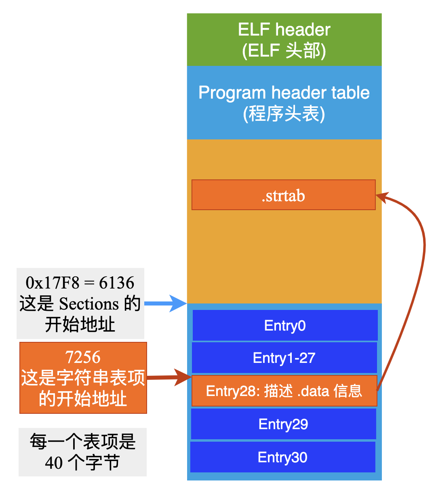

既然知道了这个表项 Entry 的地址，那么就扒开来看一下其中的二进制内容：  
执行指令：```od -Ad -t x1 -j 7256 -N 40 main```  
其中的 -j 7256 选项，表示跳过前面的 7256 个字节，也就是我们从 main 这个 ELF 文件的 7256 字节处开始读取，一共读 40 个字节。  
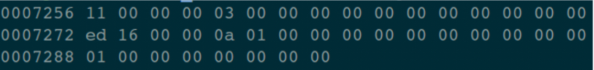  
这 40 个字节的内容，就对应了 Elf32_Shdr 结构体中的每个成员变量：  
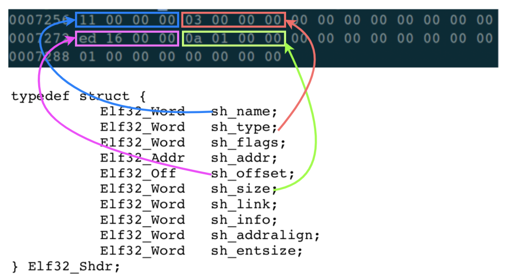  
这里主要关注一下上图中标注出来的 4 个字段:  
```s
sh_name: 字符串表这个 Section 本身的名字;
sh_type：表示这个 Section 的类型，3 表示这是一个 string table;
sh_offset: 表示这个 Section，在 ELF 文件中的偏移量。0x000016ed = 5869，意思是字符串表这个 Section 的内容，从 ELF 文件的 5869 个字节处开始;
sh_size：表示这个 Section 的长度。0x0000010a = 266 个字节，意思是字符串表这个 Section 的内容，一共有 266 个字节。
上面的7256是字符串section的entry在elf文件中的位置，这里的5869是字符串section在elf文件中的位置。
```
我们刚才使用 readelf 工具，读取到字符串表 Section 在 ELF 文件中的偏移地址是 0x0016ed，长度是 0x00010a 个字节，与我们这里的推断是完全一致的！  

知道了字符串表这个 Section 在 ELF 文件中的偏移量以及长度，那么就可以把它的字节码内容读取出来。  
执行指令: ```od -Ad -t c -j 5869 -N 266 main```  
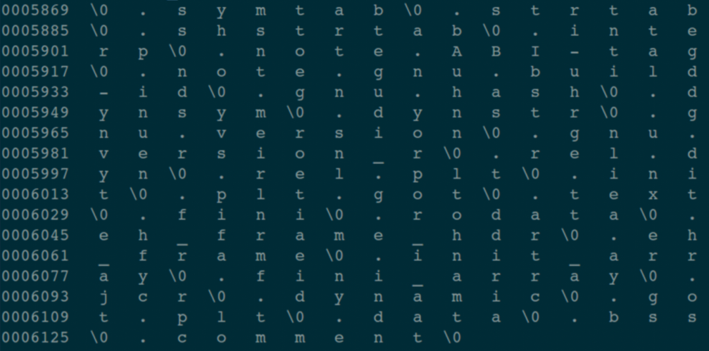  
sh_name 表示字符串表这个 Section 本身的名字，既然是名字，那一定是个字符串。但是这个字符串不是直接存储在这里的，而是存储了一个索引，索引值是 0x00000011，也就是十进制数值 17。  
现在我们来数一下字符串表 Section 内容中，第 17 个字节开始的地方，存储的是：“.shstrtab” 这个字符串  

### 读取代码段的内容
```readelf -S main```
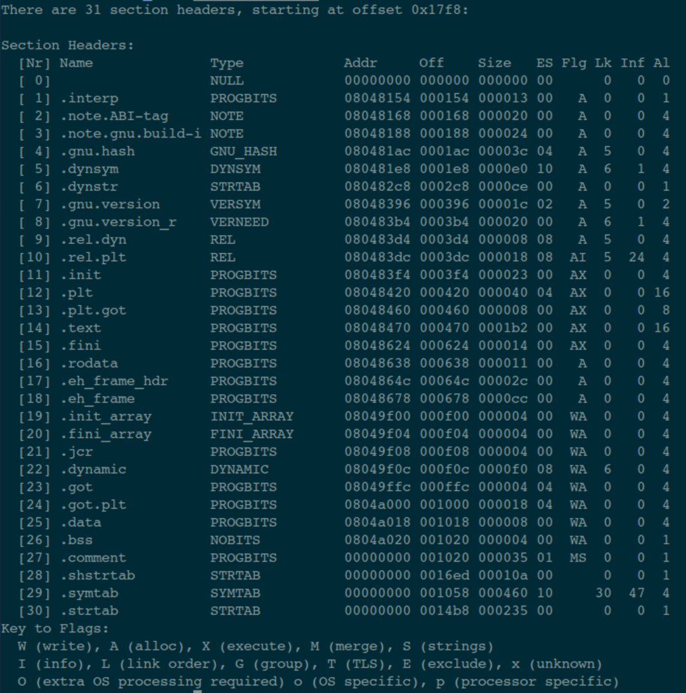
可以看到代码段是位于第 14 个表项中，加载(虚拟)地址是 0x08048470，它位于 ELF 文件中的偏移量是 0x000470，长度是 0x0001b2 个字节。  

那我们就来试着读一下其中的内容。首先计算这个表项 Entry 的地址：6136 + 14 * 40 = 6696  
(ELF header 中的第 46、47 字节内容是：28 00，表示每个表项的长度是 0x0028 = 40 个字节)  
(ELF header 中的第 32 到 35 字节内容是：F8 17 00 00，表示的就是 Section head table 在 ELF 文件中的开始地址(e_shoff))。  
然后读取这个表项 Entry，读取指令是 ```od -Ad -t x1 -j 6696 -N 40 main```:  
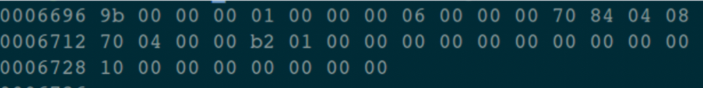  
我们也只关心下面这 5 个字段内容  
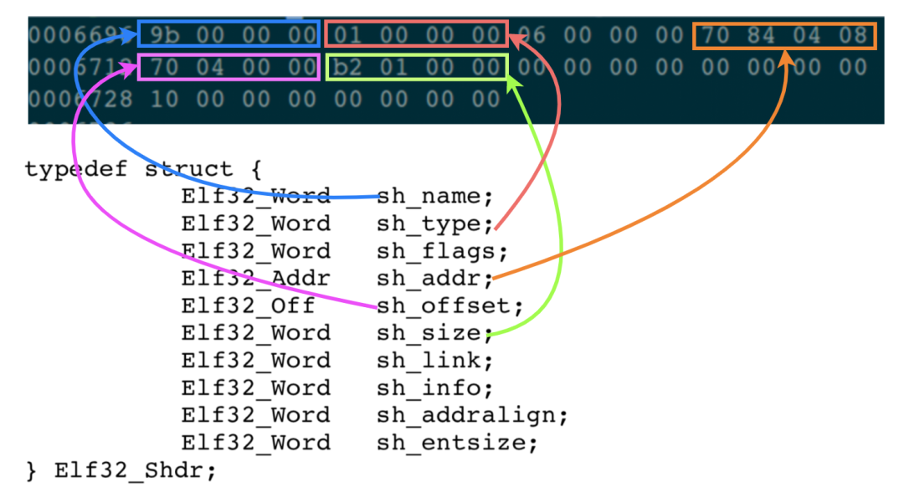  
```s
sh_name: 这回应该清楚了，表示代码段的名称在字符串表 Section 中的偏移位置。0x9B = 155 字节，也就是在字符串表 Section 的第 155 字节处，存储的就是代码段的名字。回过头去找一下，看一下是不是字符串 “.text”;

sh_type：表示这个 Section 的类型，1(SHT_PROGBITS) 表示这是代码;

sh_addr：表示这个 Section 加载的虚拟地址是 0x08048470，这个值与 ELF header 中的 e_entry 字段的值是相同的;

sh_offset: 表示这个 Section，在 ELF 文件中的偏移量。0x00000470 = 1136，意思是这个 Section 的内容，从 ELF 文件的 1136 个字节处开始;

sh_size：表示这个 Section 的长度。0x000001b2 = 434 个字节，意思是代码段一共有 434 个字节。
```
知道了以上这些信息，我们就可以读取代码段的字节码了.使用指令：```od -Ad -t x1 -j 1136 -N 434 main``` 即可。  

### Program header
文章的开头就介绍了 elf 是一个通用的文件结构，在链接器和加载器来看待是不同的。  
为了对 Program header 有更感性的认识，我还是先用 readelf 这个工具来从总体上看一下 main 文件中的所有段信息。执行指令：```readelf -l main```  
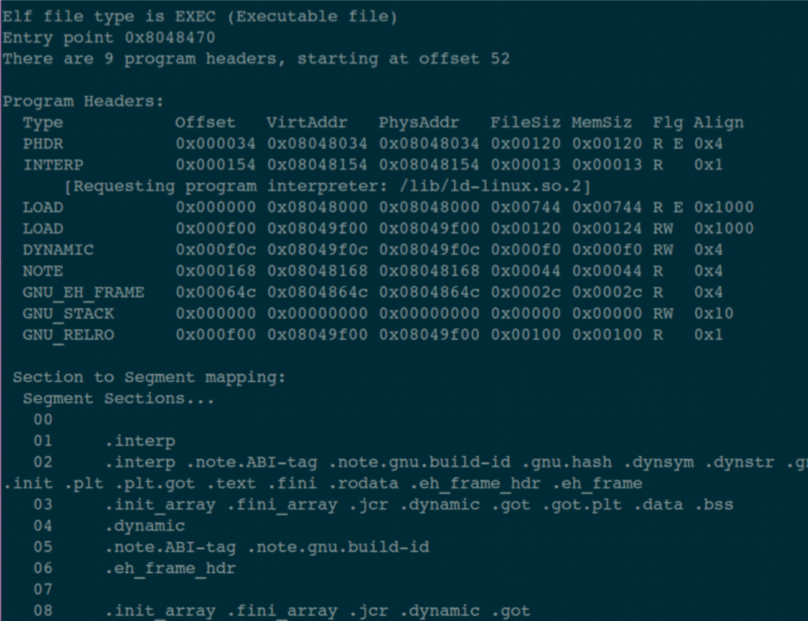  
```s
这是一个可执行程序;

入口地址是 0x8048470;

一共有 9 个 Program header，是从 ELF 文件的 52 个偏移地址开始的;
```
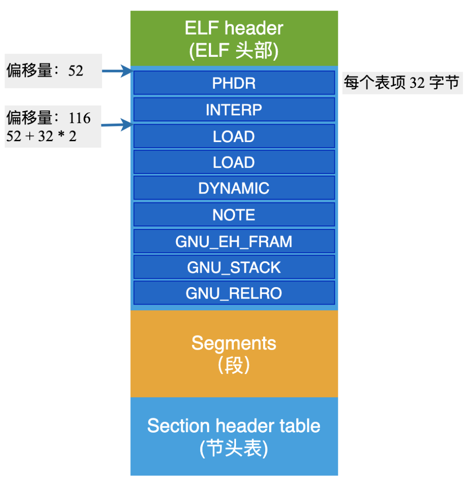  
开头我还告诉过你：Section 与 Segment 本质上是一样的，可以理解为：一个 Segment 由一个或多个 Sections 组成。  
从上图中可以看到，第 2 个 program header 这个段，由那么多的 Section 组成  

从图中还可以看到，一共有 2 个 LOAD 类型的段:  
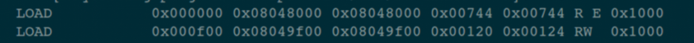  
我们来读取第一个 LOAD 类型的段，当然还是扒开其中的二进制字节码。第一步的工作是，计算这个段表项的地址信息。从 ELF header 中得知如下信息：  
```s
字段 e_phoff ：Program header table 位于 ELF 文件偏移 52 个字节的地方。

字段 e_phentsize: 每一个表项的长度是 32 个字节;

字段 e_phnum: 一共有 9 个表项 Entry;
```  
通过计算，得到可读、可执行的 LOAD 段，位于偏移量 116 字节处。执行读取指令：```od -Ad -t x1 -j 116 -N 32 main```：  
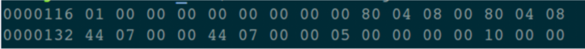  
还是把其中几个需要关注的字段，与数据结构中的成员变量进行关联一下：  
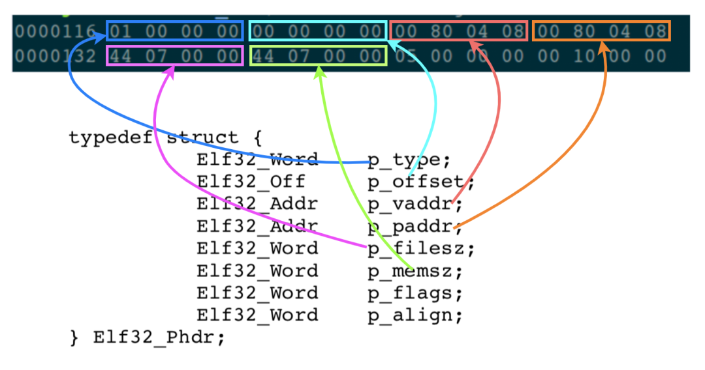  
```s
p_type: 段的类型，1: 表示这个段需要加载到内存中;

p_offset: 段在 ELF 文件中的偏移地址，这里值为 0，表示这个段从 ELF 文件的头部开始;

p_vaddr：段加载到内存中的虚拟地址 0x08048000;

p_paddr：段加载的物理地址，与虚拟地址相同;

p_filesz: 这个段在 ELF 文件中，占据的字节数，0x0744 = 1860 个字节;

p_memsz：这个段加载到内存中，需要占据的字节数，0x0744= 1860 个字节。注意：有些段是不需要加载到内存中的;
```
经过上述分析，我们就知道：从 ELF 文件的第 1 到 第 1860 个字节，都是属于这个 LOAD 段的内容。  
在被执行时，这个段需要被加载到内存中虚拟地址为 0x08048000 这个地方，从这里开始，又是一个全新的故事了。  

## 总结
ELF header 描述了文件的总体信息，以及两个 table 的相关信息(偏移地址，表项个数，表项长度);

每一个 table 中，包括很多个表项 Entry，每一个表项都描述了一个 Section/Segment 的具体信息。

链接器和加载器也都是按照这样的原理来解析 ELF 文件的